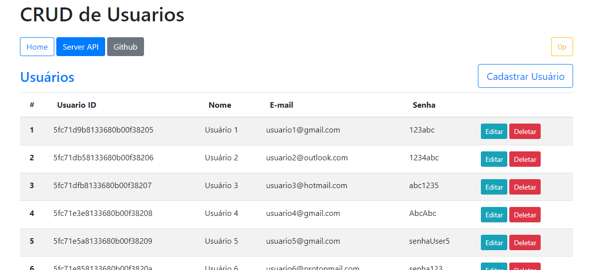
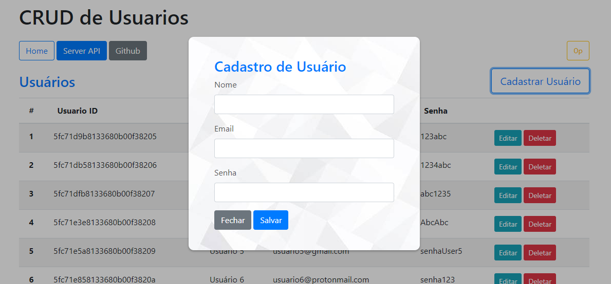
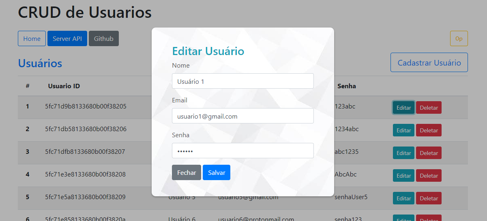

# VUE.JS CRUD

CRUD de usuario utilizando Vue.js en el front-end y Node.js con MongoDB en el back-end.

*🌎 [inglés](README.md),(README.en-br.md)*
<hr/>

<details>
  <summary>Modal <sub><sup>(click here)</sup></sub></summary>
<pre>


</pre>
</details>

## Instalación

Necesitas tener instalado [**MongoDB**](https://www.mongodb.com/try/download/community "**MongoDB**") y [**Node.js**](https://nodejs.org/en/download/ "**Node.js**") en tu máquina.

``bash
# Clonar el repositorio
$ git clone https://github.com/jzapataherrera39/Consumo_de_api_fronted
# Entra en la carpeta del proyecto
$ cd vuejs-crud
# Instalar las dependencias del proyecto
$ npm install
# Cambiar a la carpeta de front-end
$ cd cliente
# Instalar las dependencias del front-end
$ npm install
# Ejecutar el front-end
$ npm run serve
# Vuelve a la raíz del proyecto (vuejs-crud)
$ cd ...
# Ejecutar el back-end
$ npm run dev
```

Ahora tenemos el front-end corriendo en el puerto 3000, y la API REST en el puerto 8080.

Traducción realizada con la versión gratuita del traductor www.DeepL.com/Translator

## Funcionalidades

- Registrar nuevos usuarios con nombre, correo electrónico y contraseña; **(CREAR)**
- Enumerar todos los usuarios de la aplicación en una tabla en la página de inicio, una tabla con la siguiente información: **(LEER)
  - ID de usuario (ObjectId único del usuario en MongoDB)
  - Nombre;
  - Correo electrónico;
  - Contraseña;
- Editar la información de un usuario ya registrado; **(UPDATE)**
- Eliminar un usuario de la aplicación; **(DELETE)**

## Cómo funciona

En este proyecto, la división entre el front-end y el back-end está hecha, de manera que ambos comienzan en diferentes direcciones/puertos.

### REST API

En el back-end, es donde tenemos nuestra API y base de datos, desarrollada en Node.js y MongoDB, corriendo en el puerto 3000. Todas las rutas *GET*, *POST*, *PUT* y *DELETE* se encuentran en el directorio `server>routes>api>users.js`, corresponden a la ruta http `/api/users` de la aplicación (http://localhost:3000/api/users). La conexión a la base de datos se realiza en el directorio `servidor>base de datos>db.js`, en este archivo también tenemos las funciones CRUD que se exportan para ser utilizadas en las rutas de la API.

> La aplicación Postman se utilizó para probar el envío y la recepción de datos, mediante peticiones HTTP, a la API. La colección con todas las peticiones está en el directorio `>servidor>postman>vuejs-crud.postman_collection.json`, por si quieres probarlo en tu Postman.


### Front-end

El front-end, nuestro "cliente", fue desarrollado íntegramente con Vue.js - framework de JavaScript - que se ejecuta en el puerto 8080 (http://localhost:8080). El proyecto se construyó con el cliente oficial de Vue.js, el Vue CLI, facilitando la configuración y generación de la aplicación Vue.js; opción elegida por ser un entorno más profesional, según la investigación, pero también se estudió el uso de Vue.js con la inclusión directa de la etiqueta `<script>`. 

Esta aplicación Vue, está compuesta por 4 componentes:

- `<Header />`: Cabecera con título y "panel de navegación" de la aplicación;
- `<UserRegisterForm />`: Modal con el formulario para registrar un nuevo usuario;
- `<UserEditForm />`: Modal con el formulario para editar y enviar los cambios del usuario;
- `<UsersTable />`: Tabla con toda la lista de usuarios registrados en el sistema.

Todos estos componentes se renderizan en `App.vue`, la raíz de la aplicación. Define la plantilla de nuestra página, añadiendo los componentes en la etiqueta `<template>`.
Las peticiones, a la API del back-end, se hacen todas usando la propia API Fetch de JavaScript, el CRUD se pone en marcha con ella. Las peticiones *GET* y *DELETE* se realizan en el componente `<UsersTable />`, *POST* en el modal `<UserRegisterForm />`, y la petición *PUT* se realiza en el modal `<UserEditForm />`.

El framework Bootstrap, se utilizó para hacer la capacidad de respuesta y el estilo de algunos elementos de la aplicación. Los modales de registro y edición, fueron estilizados con CSS puro.


## Tecnologías

A continuación se detallan las tecnologías y dependencias utilizadas en el desarrollo del proyecto.

- [**Vue.js:**](https://vuejs.org/ "**Vue.js:**") Framework JavaScript Progressivo, usado para desenvolver interfaces de usuário dinâmicas com HMTL, CSS e JS.
- [**Bootstrap:**](https://getbootstrap.com/docs/4.5/getting-started/introduction/ "**Bootstrap:**") Framework front-end com uma grande coleção de códigos CSS, foi usado no projeto para fazer a estilização e responsividade.
- [**Node.js:**](https://nodejs.org/en/docs/ "**Node.js:**") Ambiente JavaScript no lado do servidor, o back-end do projeto foi todo desenvolvido em Node.js.
- [**Express:**](https://github.com/expressjs/express "**Express:**") Framework do Node.js, facilita a criação de aplicações web com configurações de rotas, middlewares e outras funções;
- [**Cors:**](https://www.npmjs.com/package/cors "**Cors:**") Pacote Node.js para habilitar o CORS - "Cross-Origin Resource Sharing" - na aplicação. No caso, requisições para outro domínio - localhost:3000 (nossa API).
- [**MongoDB:**](https://docs.mongodb.com/ "**MongoDB:**") Banco de dados NoSQL utilizado no projeto.
- [**Nodemon:**](https://github.com/remy/nodemon "**Nodemon:**") Usado para auxiliar no desenvolvimento, sempre atualizando a página web quando houver mudanças nos arquivos;

###### :D
